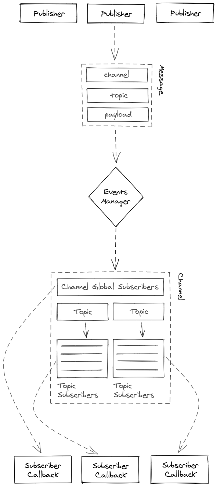

# **Events Manager**
> Obsolete Code: Please use [Process PubSub](https://github.com/m-elbably/process-pubsub) 



Global channel subscribers will receiver all published events in all topic

_To receive all events in channel you need to subscribe to_
```js
"channel": "CHANNEL_NAME"
"topic": "*"
```

**License**
MIT
